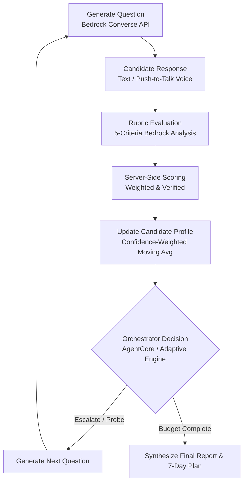

# AI Adaptive Interview Coach — System Architecture
**AWS Innovation Challenge 2026**

---

## 1. System Vision & Core Product Loop
The **AI Adaptive Interview Coach** is an intelligent, generative interview preparation platform engineered on Amazon Web Services. 

The platform departs fundamentally from static question lists:
> **"Every candidate answer changes the future interview."**



---

## 2. Cloud Architecture Topology

```
[ Candidate Browser: React 18 SPA (Vite + Tailwind + Recharts) ]
                                |
                   (HTTPS / AWS Amplify Edge)
                                |
             +------------------+------------------+
             |                                     |
   [ Amazon Cognito ]                      [ Amazon S3 ]
  (User Pools & JWT Claims)             (Private Doc/Voice Bucket)
             |                                     |
             v                                     v
   [ Amazon API Gateway ] <---------------- (Presigned Uploads)
     (HTTP API v2 + CORS)
             |
             v
   [ AWS Lambda (Python 3.12) ]
   ├── Auth Middleware (JWT sub verification)
   ├── Documents Parser (pypdf, python-docx, TXT)
   ├── Adaptive Engine (Deterministic rule layer)
   └── AgentCore Orchestrator (Bedrock Tool Calling)
             |
             +---------------------+---------------------+
             |                     |                     |
             v                     v                     v
   [ Amazon Bedrock ]      [ Amazon DynamoDB ]   [ Amazon Polly & Transcribe ]
  (Runtime Converse API)   (Single-Table Design) (Push-to-Talk Speech & TTS)
             |
             v
   [ Amazon CloudWatch ]
   (Structured JSON Logs, Latency, Sanitized Telemetry)
```

---

## 3. Generative AI Layer (Amazon Bedrock)
- **Runtime Converse API:** Uses `boto3.client('bedrock-runtime').converse(...)`.
- **Dynamic Model Selection:** Configured via `BEDROCK_MODEL_ID` (e.g. `anthropic.claude-3-5-sonnet-20241022-v2:0` or `amazon.nova-pro-v1:0`). No model IDs are hardcoded.
- **Fairness & Guardrails:** Enforces zero evaluation of demographic markers, accents, or appearance. Evaluates strictly question-relevant content against objective rubrics.
- **Pydantic Validation & Repair:** All model responses are validated against strict Pydantic schemas. If JSON parsing or field constraints fail, a controlled repair retry is executed.

---

## 4. Deterministic Adaptive Engine & Skill Profile
To ensure pedagogical integrity and prevent uncontrolled LLM hallucinations:
1. **Difficulty Scale:** Clamped strictly within `[1, 5]`:
   - 1 = Foundational principles
   - 2 = Basic application
   - 3 = Intermediate reasoning & trade-offs
   - 4 = Advanced scenario & optimization
   - 5 = Expert architectural depth
2. **Progression Formula:**
   - Overall Score $\ge 8.0$: Increase difficulty $+1$ (max 5) or switch to untested competency.
   - $5.0 \le \text{Overall Score} < 8.0$: Maintain difficulty; switch if current competency is saturated.
   - Overall Score $< 5.0$: Reduce difficulty $-1$ (min 1) to diagnose foundational fundamentals.
3. **Rolling Skill Score Formula:**
   $$S_n = (1 - w) \cdot S_{n-1} + w \cdot \text{NewScore}$$
   where $w = \alpha \times \text{Confidence}$, and $\alpha = \max(0.25, n^{-0.5})$. Low-confidence evaluations dampen update swings.

---

## 5. Agentic AI Layer (Bedrock AgentCore) & Safety Boundary
When `AGENTIC_MODE=true`, the system employs Bedrock Tool Calling with the following controlled tools:
- `get_interview_state`
- `get_candidate_skill_profile`
- `propose_next_action`

### Safety Boundary Rules:
1. **Ownership Invariant:** User sub must match interview owner.
2. **State Invariant:** Interview must be in `ACTIVE` state.
3. **Budget Invariant:** If `current_question >= question_limit`, forces `END_INTERVIEW`.
4. **Step Clamping:** Prohibited from jumping $> 1$ difficulty level in a single step.
5. **Deterministic Fallback:** On any schema violation, Bedrock timeout, or budget violation, the system seamlessly falls back to the deterministic Python engine.

---

## 6. Single-Table Database Design (Amazon DynamoDB)
- **Table Name:** `ai-interview-coach-table`
- **Billing Mode:** `PAY_PER_REQUEST` ($0 idle cost)

| Entity | PK | SK | Description |
|---|---|---|---|
| Interview Record | `USER#{sub}` | `INTERVIEW#{interviewId}` | Interview metadata, state, difficulty, and readiness score |
| Question Record | `INTERVIEW#{interviewId}` | `QUESTION#{qNum}` | Question text, candidate answer, rubric evaluation |
| Skill Record | `INTERVIEW#{interviewId}` | `SKILL#{skillName}` | Rolling competency score, observations, and confidence |
| GSI1 (Role/Date) | `ROLE#{role}` | `GSI1SK = {timestamp}` | Global query for role benchmarking and analytics |

---

## 7. Storage Isolation & Document Processing (Amazon S3)
- **Bucket Configuration:** Private, AES-256 encrypted, CORS enabled.
- **Key Prefix Scoping:** `users/{cognitoSub}/{category}/{uuid}_{filename}`.
- **Lifecycle Policy:** Voice recordings auto-expire after 7 days to eliminate storage accumulation.
- **Presigned URLs:** All document and audio uploads bypass server compute via short-lived (15-minute) presigned POST URLs.

---

## 8. Voice Interaction Architecture
- **Speech-to-Text (Push-to-Talk):**
  1. Browser records audio chunk (`MediaRecorder` in WebM format).
  2. Candidate stops recording; audio uploads to S3 presigned endpoint.
  3. AWS Lambda triggers Amazon Transcribe job.
  4. Candidate reviews and can manually correct the transcript before pressing Submit.
- **Text-to-Speech (Amazon Polly):**
  1. Bedrock Converse generates question text.
  2. Polly synthesizes natural speech using Neural Voice engine (e.g. `Ruth` or `Joanna`).
  3. Base64 audio stream plays smoothly in candidate browser.
